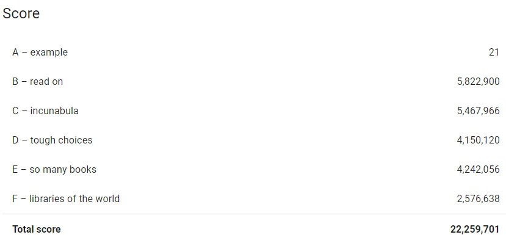

## Book Scanning

### Google Hashcode 2020 Online Qualifiation Round Question

Our initial solution gave us a total score of 20,822,639 during the online qualification round. Later on, we revised the code 
during the extended round and got the following scores. 

## How we achieved the score

After reading the problem statement and analyzing the example input and submission files, one of our team members noticed that the
example submission file could be further optimized than given. This gave us a score of 21 for the dataset a_example.txt. This also gave us
an insight that by sorting the libraries according to the sign up time of each in ascending order, increases the score.

We did the same for the dataset b_read_on.txt, giving us a score of 5,822,900 points for b. That is the maximum score you could get for that dataset, as all the books have the same score, every library has the same amount of books, the number of books each library can ship in a day is the same, and to add to that, no two libraries have the same book. 

We did the same for the rest of the datasets, and then did some revisions, sorting each library in different methods, to see what would give us a higher score. At the last few minutes, we realized a mistake we made, but couldn't fix it in time. These changes were added later on and increased our score. 

We first sorted the libraries in ascending order, and then searched through the libraries looking for duplicate books. We left only the unique books, and sorted the books in each library according to their score.

This solution could be further optimized to gain more points.
